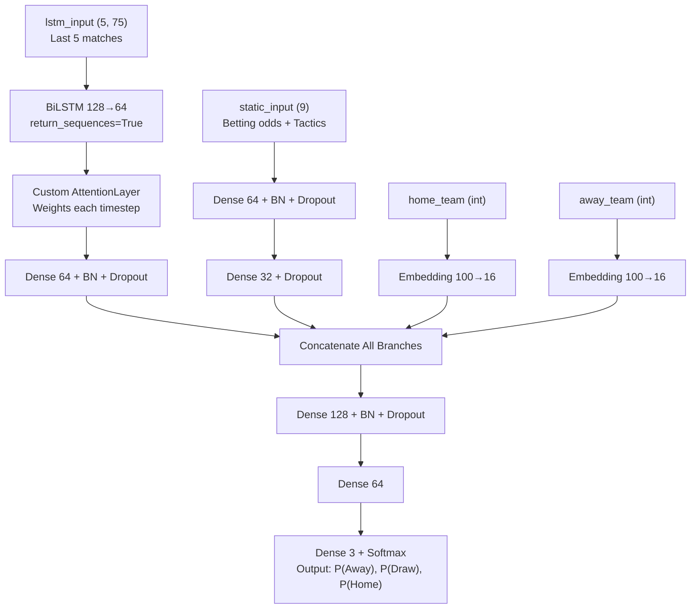
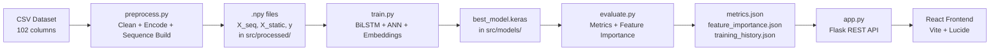

# 🧠 Premier League Deep Learning Outcome Predictor — Full Project Explainer

---

## 1. 📊 Dataset & Preprocessing (`preprocess.py`)

### The Dataset
The raw data lives at `src/dataset/epl_match_dataset_v2.csv`. It has **102 columns** covering every granular detail of a Premier League match:

| Category | Examples |
|---|---|
| **Identity** | `match_id`, `season`, `date`, `home_team`, `away_team`, `referee` |
| **In-game stats** | `home_shots_total`, `away_possession_pct`, `home_xg`, `home_corners`, etc. |
| **Tactical** | `home_formation`, `away_strategy_embedding`, `home_player_performance` |
| **Betting** | `betting_odds_home_win`, `betting_odds_draw`, `betting_odds_away_win` |
| **Target** | `result` → `H` (Home Win), `D` (Draw), `A` (Away Win) |

### Preprocessing Pipeline (Step-by-Step)

**Step 1 — Clean dirty values**
The CSV has messy sentinel values: `'##'`, `'-'`, `'?'`, `''`. These are all replaced with `NaN`. Numeric cols also had trailing `'x'` (e.g. `'2.51x'` for betting odds multipliers) which are stripped.

**Step 2 — Encode teams**
Every team name (e.g. "Arsenal", "Man City") gets mapped to an integer ID using `sklearn.LabelEncoder`. This ID is stored as `home_team_id` / `away_team_id` and is used later for **team embeddings** in the neural network.

**Step 3 — Create the target variable**
```
result_map = {'H': 2, 'D': 1, 'A': 0}
```
The model is a 3-class classifier. Each match becomes label `0`, `1`, or `2`.

**Step 4 — Remove data leakage**
Columns like `home_goals_ft`, `away_goals_ft`, `result` — things you'd only know *after* the match — are **dropped**. Otherwise the model would "cheat" by seeing the answer during training.

**Step 5 — Encode categorical features**
Six tactical columns are label-encoded (e.g. `"attack"` → `2`):
- `home_strategy_embedding`, `away_strategy_embedding`
- `home_player_performance`, `away_player_performance`
- `home_formation`, `away_formation`

Each encoder is saved as a `.pkl` file in `src/encoders/`.

**Step 6 — Split into Temporal vs Static features**

| Type | What | Why |
|---|---|---|
| **Temporal** (~73 cols) | In-game stats: shots, xG, possession, etc. | These change match to match and represent **form over time** |
| **Static** (9 cols) | Betting odds + formations | These are **match-specific context** that doesn't form a time series |

**Step 7 — Build 5-match sequences (the key innovation)**

For **each team**, the pipeline looks at that team's entire match history and creates a sliding window of 5 consecutive matches:

```
Match 1, 2, 3, 4, 5  →  predict Match 6
Match 2, 3, 4, 5, 6  →  predict Match 7
...
```

This gives the model "memory" — it knows what happened in the last 5 games before it makes a prediction.

**Final shapes saved:**
```
X_seq:    (N, 5, 75)   ← N samples, 5 timesteps, ~75 temporal features
X_static: (N, 9)       ← N samples, 9 static features
y:        (N,)         ← class labels 0/1/2
```
Split: **70% train / 15% validation / 15% test**. Saved as `.npy` files in `src/processed/`.

---

## 2. 🤖 Model Training & Architecture (`train.py`)

### Architecture: Hybrid LSTM + ANN + Embedding

The model has **4 inputs** and **4 branches** merged together:



### The Key Components

**1. Bidirectional LSTM Branch**
- Takes the sequence of 5 past matches
- `BiLSTM(128, return_sequences=True)` + `BiLSTM(64, return_sequences=True)` — reads the sequence forwards AND backwards to capture momentum in both directions
- Output: a sequence of 5 context vectors

**2. Custom Attention Layer (`AttentionLayer`)**
- After the BiLSTM, instead of just using the last timestep, attention assigns a **weight** to each of the 5 matches
- A match 4 games ago might be less relevant than last week's match — attention learns these weights automatically
- Formula: `α = softmax(tanh(x·W + b))`, then `context = Σ(α × x)`

**3. ANN Branch (Static Features)**
- A simple feedforward network processes match-specific context (betting odds, formation)
- Dense 64 → BatchNorm → Dropout → Dense 32

**4. Team Embeddings**
- Each team ID is looked up in a trainable 16-dimensional embedding table
- This lets the model learn team-specific "DNA" (e.g. Man City might get an embedding pointing toward "possession-based, high scorer")

**5. Merged Output**
All 4 branches are concatenated and passed through 2 more Dense layers before the final 3-class softmax output.

### Custom Loss: Focal Loss
```python
focal_loss(y_true, y_pred, gamma=2.0)
```
Standard cross-entropy treats all errors equally. **Focal loss** down-weights easy, confident predictions and focuses the model's learning on **hard, misclassified examples** (especially useful here since draws are very hard to predict). `gamma=2.0` is the focusing parameter.

### Training Setup

| Setting | Value |
|---|---|
| Optimizer | Adam (lr=0.0005) |
| Epochs | Up to 100 |
| Batch size | 32 |
| Class weights | Auto-balanced (draws are rare) |
| Early stopping | Patience 10 on val_loss |
| LR decay | ×0.5 every 5 epochs without improvement |
| Checkpoint | Saves `best_model.keras` (best val_loss) |

---

## 3. 📐 Evaluation (`evaluate.py`)

After training, evaluation runs on the held-out **test set (15%)** and produces:

**Metrics computed:**
- Accuracy, Macro F1, Weighted F1, Precision, Recall
- Confusion matrix (3×3: Away vs Draw vs Home)
- Per-class classification report

**Permutation Feature Importance:**
For each feature (one at a time), the values are randomly shuffled in the test set and accuracy is re-measured. If accuracy drops a lot → that feature was important. If it barely changes → the feature doesn't matter much.

**SHAP Values (optional):**
`shap.DeepExplainer` computes how much each feature pushed the prediction toward or away from each class. Saved as `shap_values.json`.

All outputs are saved as JSON in `src/models/` so the Flask API can serve them live.

---

## 4. 🔗 How Everything Is Put Together

### The Full Pipeline



### Flask Backend (`app.py`)
The backend loads **everything once at startup**:
- The trained Keras model
- All LabelEncoders
- The full dataset (for live inference)

**Key API endpoints:**

| Route | Method | Purpose |
|---|---|---|
| `/api/teams` | GET | List all teams available in dataset |
| `/api/team-analysis` | POST | Match Insights — real model inference |
| `/api/live-predict` | POST | Live Predict — rule-based simulation |
| `/api/metrics` | GET | Serve evaluation metrics to UI |
| `/api/feature-importance` | GET | Serve feature importance chart data |
| `/api/training-history` | GET | Serve loss/accuracy curves |

**For `/api/team-analysis`** (the main prediction):
1. Takes `home_team` + `away_team` names
2. Filters the dataset to get the **last 5 real matches** for each team
3. Builds `X_seq` (shape 1×5×75) and `X_static` (shape 1×9) from real historical data
4. Pads/crops to exactly match what the model expects
5. Gets team IDs → embedding lookup
6. Runs `model.predict(...)` → gets 3 probabilities
7. Generates human-readable insights from the stats
8. Returns JSON to frontend

### React Frontend (`src/components/`)

| Component | Role |
|---|---|
| `Predictor.jsx` | **Match Insights** tab — team selector + model output |
| `OngoingMatch.jsx` | **Live Predict** tab — interactive simulator |
| `ModelPerformance.jsx` | Shows accuracy, confusion matrix |
| `FeatureImportance.jsx` | Bar chart of feature importance |
| `DatasetOverview.jsx` | Dataset statistics |
| `ApiStatusBar.jsx` | Shows backend connection health |

The React app calls Flask at `http://localhost:5000` and renders the results as interactive charts and cards.

---

## Summary

> This project demonstrates a **complete end-to-end deep learning pipeline** for sports outcome prediction. It uses real match sequences to train a Hybrid LSTM+ANN model with custom Attention and Focal Loss, then serves predictions through a Flask REST API consumed by a React dashboard.

**The hardest part** was ensuring the feature shapes at inference time (app.py) exactly match what was used during training (preprocess.py) — which required the dynamic feature identification and safe padding logic we built.

---

## 5. ⭐ What Makes This Project Unique

Most football prediction projects online are very basic — they use a single tabular model (like Logistic Regression or a plain neural network) on raw match stats, treating every match as independent. This project does several things that are genuinely more sophisticated:

### 1. 🔁 Temporal Sequences (Not Just Single Matches)
Instead of asking *"who wins given today's stats?"*, this model asks *"who wins given how both teams have been performing over the last 5 games?"*. The sliding-window sequence builder makes the model **form-aware** — a team on a 5-game losing streak is treated differently from one on a winning run, even if their raw stats look similar.

### 2. 🧠 Custom Attention Mechanism
Most LSTM-based models just use the output of the last timestep (the most recent match). This project adds a **trainable Attention Layer** on top of the BiLSTM, which learns to weigh all 5 past matches differently. A dominant win 3 games ago might be more predictive than a last-minute draw yesterday — attention figures this out automatically during training.

### 3. 🏟️ Team Identity Embeddings
Rather than treating team ID as a simple one-hot feature, the model uses **learnable Embeddings** (like how NLP models embed words). Each of the ~20 teams gets a 16-dimensional vector that the model trains to represent that team's "style" — possession-based, counter-attacking, set-piece reliant, etc. This is borrowed directly from natural language processing.

### 4. ⚖️ Focal Loss for Imbalanced Classes
Draws are genuinely hard to predict and occur less often than decisive results. Standard cross-entropy loss under-trains on draws because the model can afford to be wrong on them and still look decent overall. **Focal Loss** with `gamma=2` forces the model to pay more attention to these ambiguous, hard-to-classify cases — a technique from computer vision (specifically object detection) applied to sports prediction.

### 5. 🔀 Hybrid Architecture (LSTM + ANN + Embeddings)
Most projects pick one: either a recurrent model *or* a feedforward one. This project **fuses both in parallel**:
- The BiLSTM branch captures *temporal dynamics* (form over time)
- The ANN branch captures *match-day context* (betting odds, formations)
- The embedding branch captures *team identity*

All three are concatenated and passed through a final decision layer. This multi-branch design means no single type of information dominates.

### 6. 🔬 Permutation Feature Importance (Not Just Accuracy)
Most student projects stop at accuracy. This one runs **permutation importance** on the test set — systematically shuffling each feature and measuring the accuracy drop — to understand *which features the model actually relies on*. This produces a real, explainable feature ranking, not just a black-box number.

### 7. 🖥️ Full Production-Style Deployment
The trained model isn't just a Jupyter notebook. It's served through a **Flask REST API** consumed by a **React dashboard** with real-time inference, team selectors, animated probability bars, H2H history, and AI-generated narrative insights. Most deep learning projects never get past a script — this one has a complete user-facing product.

---

> In short: this project combines ideas from **NLP** (embeddings, attention), **computer vision** (focal loss), **time-series modeling** (BiLSTM sequences), and **full-stack engineering** (Flask + React) — all applied to a sports analytics problem. That combination is genuinely uncommon even in professional sports analytics work.
